<div align="center">
  <p>
    <h1>g2.gangsters.pl bot</h1>
    <h3>Aktualny na 07.01.2024 (chrome/firefox)</h3>
  </p>
<h1>W ramach sprzeciwu wobec wybiorczego postepowania admina w walce z botami zdecydowaliśmy się umieścić działającego bota online:</h1>
</div>

## Zdanie administratora na temat tych skryptów:

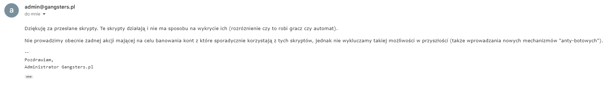
## Instalacja:

* Pobierz wtyczke tampermonkey: [Chrome web store](https://chromewebstore.google.com/detail/tampermonkey/dhdgffkkebhmkfjojejmpbldmpobfkfo?hl=pl)
* Zainstaluj skrypt <b style="color: yellow;">bot.user.js</b> znajdujący sie w tym repository (czyli pod tym [linkiem](https://github.com/katanatop1/g2bot/raw/main/bot.user.js) - jak wejdziesz pod ten link to powinno samo zaproponować instalacje)
* Każda automatyzacja dziala na oddzielny strone oraz może działać w tle (np możesz robić tournament i ring w tle jednocześnie).
* Bot automatycznie sprawdza ostatnią wersje dostępną na github i informuje w razie gdy gracz ma starą wersje
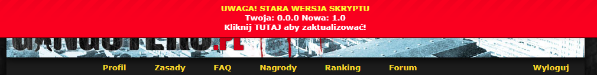
## Ustawienia:
Większość ustawień jest dostępna z poziomu gry:<br>


* <b>Auto Login</b><br>
Jeśli chcesz aby bot się automatycznie logował wrzuć swój email i hasło aby automatycznie cię
logowało po wejściu w gangsters.pl. Email/haslo podajesz w ustawienach skryptu
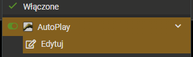
```js
    const autologin_email = '';
    const autologin_password = '';
```
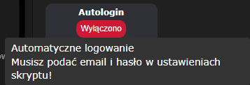

*  <b>Auto Atak 100%</b><br>
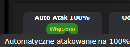

*  <b>Automatyczne odbierane misji</b><br>
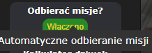

*  <b>TOURNAMENT</b><br>
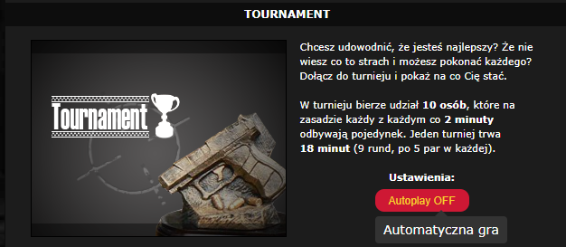

*  <b>RING</b><br>
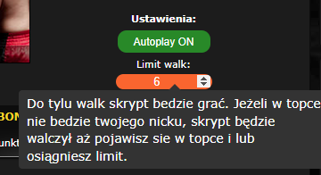

*  <b>KASYNO</b><br>
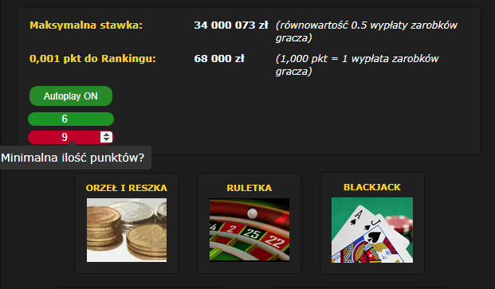

*  <b>VIP</b><br>
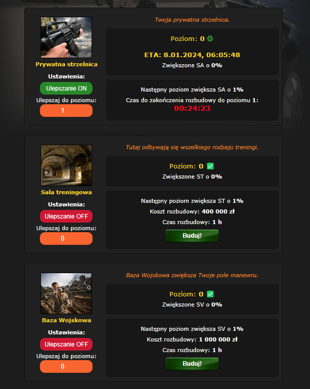

*  <b>STRZELNICA</b><br>
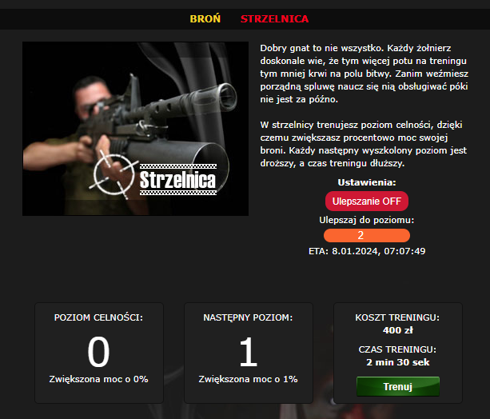

*  <b>Kalkulatory (UWAGA! MOGĄ BYĆ NIEDOKŁADNE)</b><br>
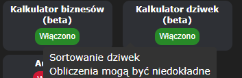<br>
<b>Biznesy</b><br>
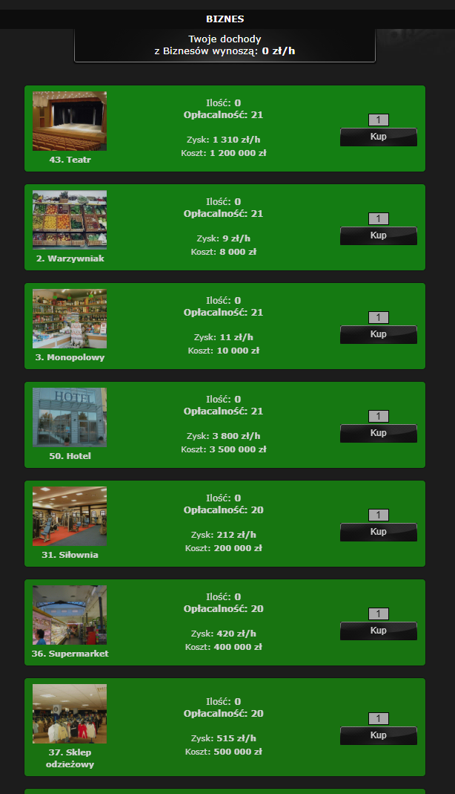<br>
<b>Dziwki</b><br>
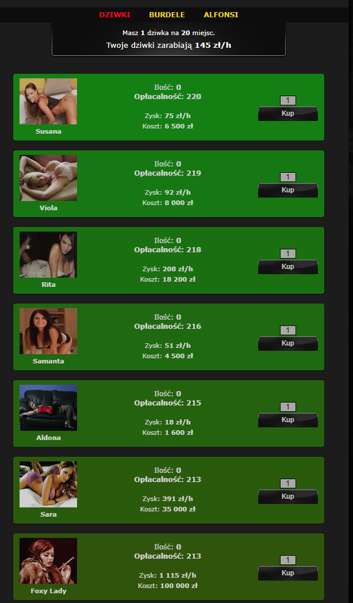


